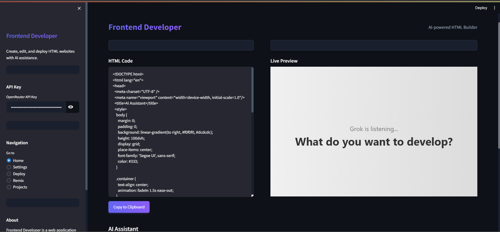

# 🚀 Frontend Developer



Frontend Developer is a powerful web application that allows you to create, edit, and deploy HTML websites with the help of AI. It features a Monaco-based code editor, AI integration for generating HTML content, and deployment options to various platforms.

## ✨ Features

- **🖥️ Live HTML Editing**: Edit HTML code in real-time with syntax highlighting and auto-completion.
- **🤖 AI Integration**: Generate HTML content using AI with OpenRouter API, powered by Grok 3 Mini Beta for advanced website development.
- **🚀 Deployment Options**: Deploy your projects to GitHub Pages, Netlify, Vercel, or save locally.
- **📁 Project Management**: Save, load, and manage your projects.
- **🔄 Remix Functionality**: Load and remix existing projects.
- **⚙️ Customizable Settings**: Adjust editor theme, font size, and API settings.

## 📋 Prerequisites

- Python 3.7 or higher
- pip (Python package installer)

## 🛠️ Installation

1. Clone the repository:
   ```
   git clone https://github.com/yourusername/Frontend_Builder.git
   cd Frontend_Builder
   ```

2. Run the installation script:
   ```
   python install.py
   ```
   This script will:
   - Check your Python version
   - Create a virtual environment
   - Install all required dependencies
   - Create necessary directories
   - Create a `.env` file for your API key
   - Create an example project

### Manual Setup (Without venv folder)

If you don't have the venv folder (for example, when downloading from GitHub), follow these steps:

1. Create a new virtual environment:
   ```
   python -m venv venv
   ```

2. Activate the virtual environment:
   - On Windows (PowerShell):
   ```
   .\venv\Scripts\Activate.ps1
   ```
   - On Windows (Command Prompt):
   ```
   .\venv\Scripts\activate.bat
   ```
   - On macOS/Linux:
   ```
   source venv/bin/activate
   ```

3. Install the required packages:
   ```
   pip install -r requirements.txt
   ```

4. Run the application:
   ```
   streamlit run app.py
   ```

Note: Make sure you have Python 3.7 or higher installed on your system.

3. Add your OpenRouter API key to the `.env` file:
   ```
   OPENROUTER_API_KEY=your_api_key_here
   ```
   You can get an API key from [OpenRouter](https://openrouter.ai/).

## 🚀 Usage

### Running the Application

You can run the application using the provided run script:

```
python run.py
```

This will start the application using Streamlit on port 8501.

### AI-Powered Development

Frontend Developer leverages Grok 3 Mini Beta through the OpenRouter API to provide intelligent assistance in website development. This powerful AI model helps with:

- Generating responsive HTML layouts
- Creating modern CSS styles
- Implementing interactive JavaScript functionality
- Optimizing code for performance
- Suggesting best practices for web development

#### Command-line Options

- `--no-streamlit`: Run without Streamlit (direct Python execution)
- `--port`: Specify a custom port for Streamlit (default: 8501)

Example:
```
python run.py --port 8502
```

### 🧪 Testing the Application

To check if your installation is working correctly, run the health check script:

```
python health_check.py
```

This will verify:
- All required directories exist
- All required files exist
- Your API key is set
- The OpenRouter API is accessible

## 📂 Application Structure

```
frontend-developer/
├── app.py                  # Main application file
├── components/             # UI components
│   ├── sidebar.py          # Sidebar component
│   ├── editor.py           # Editor component
│   ├── deployment.py       # Deployment component
│   ├── remix.py            # Remix component
│   ├── settings.py         # Settings component
│   └── projects.py         # Projects component
├── utils/                  # Utility functions
│   ├── api.py              # API utilities
│   ├── deployment.py       # Deployment utilities
│   ├── editor.py           # Editor utilities
│   ├── init.py             # Initialization utilities
│   ├── monaco.py           # Monaco editor utilities
│   └── project.py          # Project utilities
├── styles/                 # CSS styles
│   └── main.css            # Main stylesheet
├── projects/               # Saved projects
├── examples/               # Example projects
├── install.py              # Installation script
├── run.py                  # Run script
├── health_check.py         # Health check script
├── requirements.txt        # Python dependencies
└── README.md               # This file
```

## 💻 Development

### Adding New Features

To add new features to Frontend Developer:

1. Create a new component in the `components/` directory
2. Add utility functions in the `utils/` directory if needed
3. Update the main `app.py` file to include your new component

### 🎨 Customizing Styles

You can customize the application's appearance by modifying the CSS in `styles/main.css`.

## 🚀 Deployment

Frontend Developer supports deployment to various platforms:

- **GitHub Pages**: Deploy your project to GitHub Pages
- **Netlify**: Deploy your project to Netlify
- **Vercel**: Deploy your project to Vercel
- **Local**: Save your project locally
